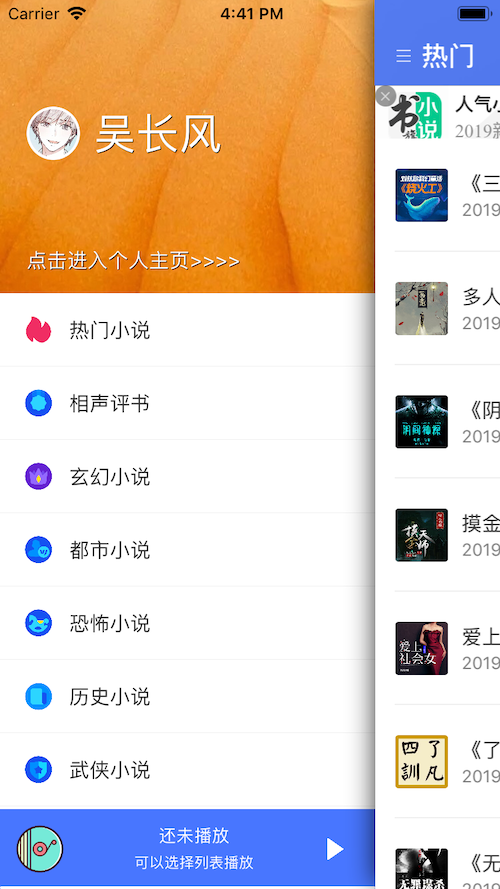
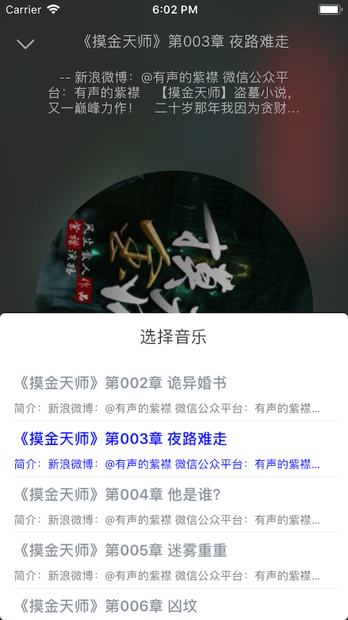
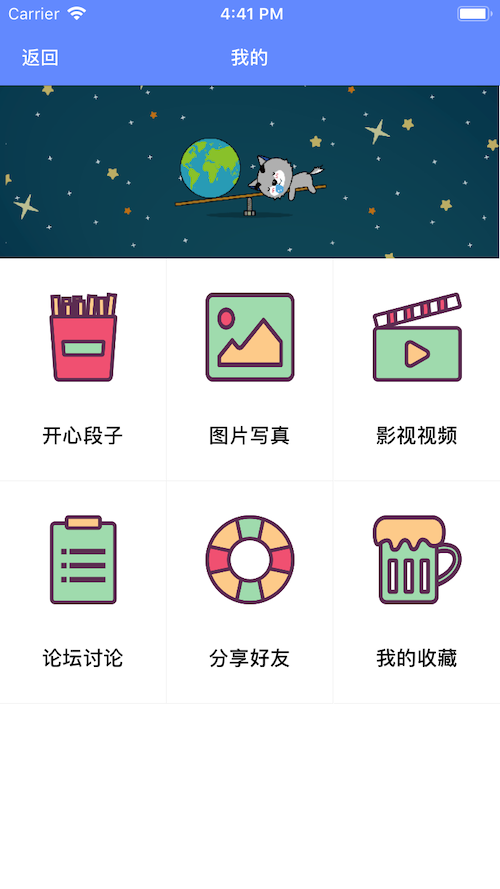
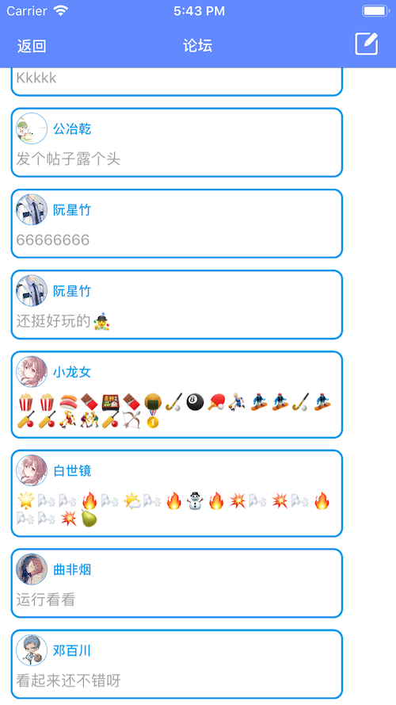

# 编程宝典

[](LICENSE)
[](https://github.com/kevindcw/DProgram_ios/commits/master)
[](https://github.com/kevindcw/DProgram_ios)


## 效果图：
目前主要是有书籍页面，题库页面，论坛讨论和资讯新闻这几个大的板块：

<p align="center">
  
  
  
</p>

<p align="center">
  
  
  
</p>


## 实现动态图(文件大，可能要等待5秒)：


## 小程序演示(个人开发者不让有论坛，代码里有)[小程序源码](https://github.com/kevindcw/DProgram_WeChat)：


## 代码结构：
好多方法的实现，都是放在根视图里了


## 代码：
1.UITabBarController的跳动和声音特效，遵守UITabBarControllerDelegate协议

```
//底部按钮动画
- (void)tabBar:(UITabBar *)tabBar didSelectItem:(UITabBarItem *)item {
    
    NSInteger index = [tabBar.items indexOfObject:item];
    [self animationWithIndex:index];
   
    
}
// 动画声音
- (void)animationWithIndex:(NSInteger)index{
    
    //底部按钮音效
    NSString*voice=[NSString stringWithFormat:@"voice%ld.mp3",(long)index];
    NSURL *moveMP3=[NSURL fileURLWithPath:[[NSBundle mainBundle].resourcePath stringByAppendingPathComponent:voice]];
    NSError *err=nil;
    _audioPlayer=[[AVAudioPlayer alloc] initWithContentsOfURL:moveMP3 error:&err];
    _audioPlayer.volume=0.5;
    [_audioPlayer prepareToPlay];
    if (err!=nil) {
        NSLog(@"move player init error:%@",err);
    }else {
        [_audioPlayer play];
    }
    
    //底部按钮特效
    NSLog(@"点击====%ld",(long)index);
    UIView *tabBarButton =_tabbarbuttonArray[index];
    CABasicAnimation*pulse = [CABasicAnimation animationWithKeyPath:@"transform.scale"];
    pulse.timingFunction= [CAMediaTimingFunction functionWithName:kCAMediaTimingFunctionEaseInEaseOut];
    pulse.duration = 0.08;
    pulse.repeatCount= 1;
    pulse.autoreverses= YES;
    pulse.fromValue= [NSNumber numberWithFloat:0.7];
    pulse.toValue= [NSNumber numberWithFloat:1.3];
    
    [[tabBarButton layer]  addAnimation:pulse forKey:nil];
    
  
    
}


```

2.登录时候的花瓣效果，是我把以前做直播时候的礼物特效加里面了，已经封装过了直接调用就行，如果有兴趣的话也可以在DShowPropView看实现，主要是iOS的粒子效果；

```
   DPropsModel *PropsModel=[DPropsModel new];
    PropsModel.idString=@"0";
    [self.showPropView didReceiveProp:PropsModel];


```

3.更多代码大家可以直接下载看，这里就不多介绍了。。。

